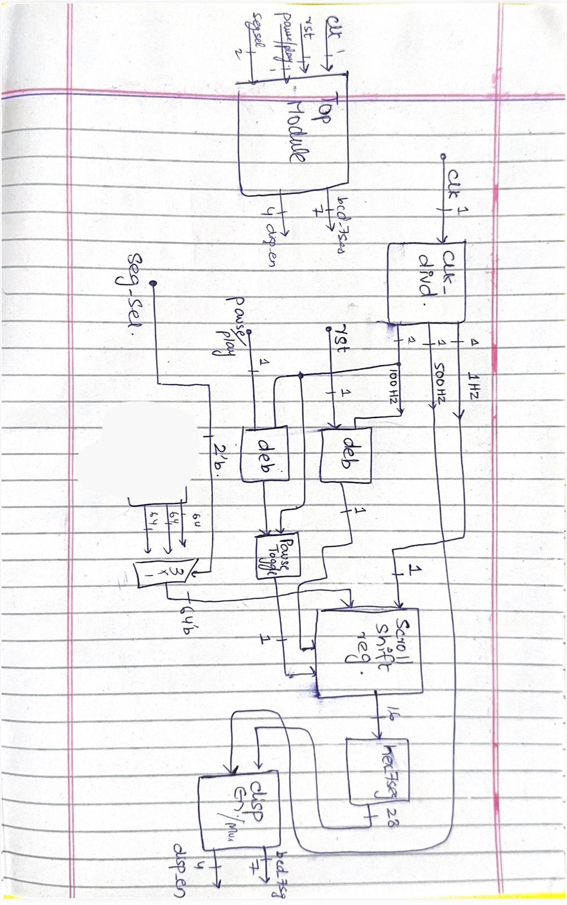
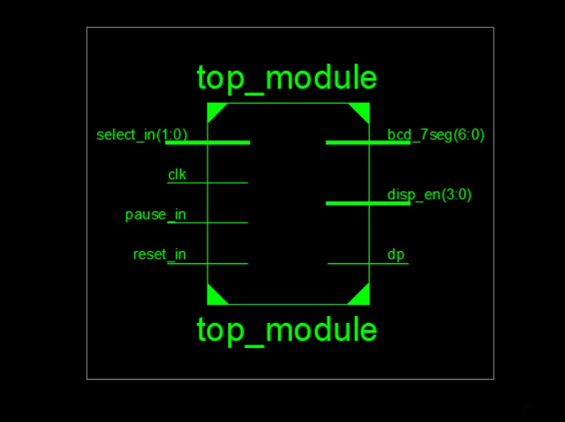
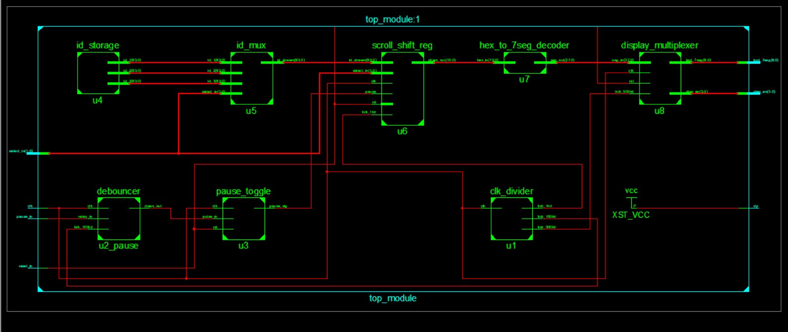

# 3-ID Scrolling 7-Segment Display
### FPGA Verilog Implementation — Spartan-3


---

## Overview

This repository contains a fully modular Verilog implementation of a **scrolling 7-segment display system** that cycles through **3 unique IDs** on a multiplexed 4-digit display, targeting the **Xilinx Spartan-3 FPGA**.

The design operates from a single **50 MHz master clock**, internally divided into multiple tick rates for display multiplexing, scrolling control, and debouncing. The system supports **ID selection** via a 2-bit input, a **pause/resume** function via a debounced push button, and a synchronous **reset**. All segment outputs use **active-low logic** consistent with standard 7-segment display hardware.

---

## Block Diagram

> Initial architecture planning — drawn before implementation.



---

## Schematics (Xilinx ISE)

### Top Module — Port Definitions


### Full Design — Complete Module Wiring


---

## Top-Level I/O

| Port | Direction | Width | Description |
|------|-----------|-------|-------------|
| `select_in` | Input | [1:0] | Selects which of the 3 IDs to display |
| `clk` | Input | 1-bit | 50 MHz master clock |
| `pause_in` | Input | 1-bit | Push button to pause/resume scrolling |
| `reset_in` | Input | 1-bit | Synchronous system reset |
| `bcd_7seg` | Output | [6:0] | Active-low segment cathode outputs (a–g) |
| `disp_en` | Output | [3:0] | Active-low anode enables for 4-digit display |
| `dp` | Output | 1-bit | Decimal point — tied high (always off) |

---

## Architecture

The system is composed of **8 sub-modules** instantiated and wired together in `top_module.v`. Signal flow proceeds as follows:

```
                        ┌──────────────────────────────────────────────────────┐
                        │                     top_module                        │
                        │                                                        │
  select_in[1:0] ──────►│──► id_mux (u5) ◄── id_storage (u4)                  │
                        │        │                                               │
                        │        ▼                                               │
  clk ─────────────────►│── clk_divider (u1) ──► scroll_shift_reg (u6)         │
                        │        │                        │                      │
  pause_in ────────────►│── debouncer (u2_pause)          │                     │
                        │        │                        ▼                      │
                        │        ▼               hex_to_7seg_decoder (u7)        │
                        │  pause_toggle (u3)              │                      │
                        │        │                        ▼                      │──► bcd_7seg[6:0]
  reset_in ────────────►│────────┴───────────► display_multiplexer (u8)         │──► disp_en[3:0]
                        │                                                        │──► dp
                        └──────────────────────────────────────────────────────┘
```

---

## Module Descriptions

### `top_module.v` — Top-Level Wrapper
The structural top-level module. Instantiates all sub-modules and routes internal signals between them. Defines all external FPGA I/O ports including `select_in`, `clk`, `pause_in`, `reset_in`, `bcd_7seg`, `disp_en`, and `dp`. The decimal point output (`dp`) is tied permanently high via `XST_VCC`.

---

### `clk_divider.v` — Clock Divider `(u1)`
Accepts the 50 MHz master clock and generates three independent enable tick signals at different frequencies:
- **`tick_1hz`** — 1 Hz tick for scrolling control
- **`tick_100hz`** — 100 Hz tick for general timing
- **`tick_500hz`** — 500 Hz tick for display multiplexing refresh

All ticks are single-cycle enable pulses, not divided clocks, ensuring safe synchronous design throughout.

---

### `debouncer.v` — Button Debouncer `(u2_pause)`
A shift-register based debouncing circuit that filters the noisy signal from the physical `pause_in` push button. Samples the input over multiple clock cycles and only asserts a clean `clean_out` pulse once the signal has stabilized, preventing false triggers in downstream logic.

---

### `pause_toggle.v` — Pause Toggle `(u3)`
Receives the debounced button output and implements a toggle flip-flop to alternate the system between **scrolling** and **paused** states on each valid button press. The `pause_flag` output is distributed to the scroll shift register to halt or resume scrolling.

---

### `id_storage.v` — ID Storage `(u4)`
Stores the three predefined IDs as fixed internal constants. Outputs all three IDs simultaneously as parallel buses (`id_1[3:0]`, `id_2[3:0]`, `id_3[3:0]`) for routing into the multiplexer.

---

### `id_mux.v` — ID Multiplexer `(u5)`
A combinational multiplexer that selects one of the three stored IDs based on the 2-bit `select_in` input. Routes the chosen ID as `id_stream[3:0]` to the scroll shift register for display.

---

### `scroll_shift_reg.v` — Scroll Shift Register `(u6)`
The core scrolling engine. Receives the selected ID stream and shifts it across the 4-digit display at a rate controlled by `tick_1hz`. Responds to `pause_flag` to halt scrolling and `reset_in` to return to the initial state. Outputs `chars_out[15:0]` — the full 4-digit display word — to the decoder.

---

### `hex_to_7seg_decoder.v` — Hex to 7-Segment Decoder `(u7)`
A purely combinational look-up module. Converts each 4-bit hexadecimal nibble from `chars_out` into the corresponding 7-bit active-low segment pattern for driving the cathode outputs of the 7-segment display.

---

### `display_multiplexer.v` — Display Multiplexer `(u8)`
Time-multiplexes the 4 display digits by rapidly cycling the active anode (`disp_en[3:0]`) at `tick_500hz` while simultaneously presenting the matching segment data on `bcd_7seg[6:0]`. At 500 Hz, persistence of vision makes all digits appear simultaneously lit to the human eye.

---

## Repository Structure

```
Scrolling-7seg-display-fpga/
│
├── src/
│   ├── top_module.v              # Top-level wrapper
│   ├── clk_divider.v             # Multi-rate clock tick generator
│   ├── debouncer.v               # Shift-register button debouncer
│   ├── pause_toggle.v            # Pause/resume toggle logic
│   ├── id_storage.v              # Stores the 3 predefined IDs
│   ├── id_mux.v                  # Selects active ID via select_in
│   ├── scroll_shift_reg.v        # Scrolling shift register engine
│   ├── hex_to_7seg_decoder.v     # Hex to 7-segment encoding
│   └── display_multiplexer.v     # 4-digit time-multiplexed driver
│
├── images/
│   ├── block_diagram.jpeg        # Hand-drawn architecture plan
│   ├── top_module_schematic.jpeg # ISE top module port schematic
│   └── full_schematic.jpeg       # ISE full design schematic
│
├── constraints/
│   └── spartan3.ucf              # Pin assignments — Spartan-3 board
│
└── README.md
```

---

## Tools Used

| Tool | Purpose |
|------|---------|
| **Verilog HDL** | Hardware description and design |
| **Xilinx ISE** | Synthesis, implementation, and bitstream generation |
| **ModelSim** | RTL simulation and waveform verification |
| **Spartan-3 FPGA Board** | Target deployment hardware |

---

## Getting Started

### Simulation (ModelSim)
1. Open ModelSim and create a new project
2. Add all `.v` source files from `src/` and the testbench from `tb/`
3. Compile all sources
4. Simulate `tb_top_module` and observe waveforms for `bcd_7seg`, `disp_en`, and internal tick signals

### Synthesis & Implementation (Xilinx ISE)
1. Open Xilinx ISE and create a new project targeting **Spartan-3**
2. Add all source files from `src/`
3. Add the constraints file `spartan3.ucf` with correct pin mappings
4. Run **Synthesize → Implement Design → Generate Programming File**
5. Program the board using **iMPACT**

---

## Design Notes

- Single **50 MHz** clock input — all timing derived internally via `clk_divider`
- Enable-tick architecture avoids clock domain crossings and synthesis warnings
- **Active-low** logic on both `bcd_7seg` (cathodes) and `disp_en` (anodes)
- Decimal point (`dp`) permanently disabled via `XST_VCC` tie-high
- Pause functionality is fully debounced in hardware before reaching control logic
- Reset is synchronous and propagates through all stateful modules

---

## Author

**Jon Abbas Kazmi**
BSc Electronics and Computing Engineering

---

*Designed and implemented using Verilog HDL on Xilinx Spartan-3 FPGA.*
